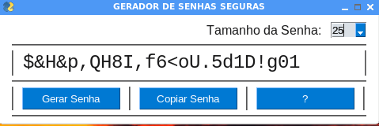

# GERADOR_DE_SENHAS_SEGURAS

Este é um gerador de senhas seguras com letras e caracteres especiais alternados.
É possível escolher o número de dígitos que sua senha terá.
Interface gráfica usando <a href='https://github.com/PySimpleGUI/PySimpleGUI'>pysimplegui</a>

# Instalação:
- Acesse o terminal ou prompt de comando de seu computador e crie um clone deste projeto:
- git clone https://github.com/elizeubarbosaabreu/GERADOR_DE_SENHAS_SEGURAS.git
- Entre dentro da pasta e instale os requerimentos:
- cd /GERADOR_DE_SENHAS_SEGURAS
- pip install -r requirements.txt
- pip3 install -r requirements.txt

# Usar o software:
- Use o Pycharm, Thonny, Vs Studio ou outra IDE python para rodar o arquivo 'Strong_Password_Generator.py' para ter a interface gráfica...

# Mesmo com senhas seguras você deve tomar alguns cuidados:
- Usar uma senha diferente para cada serviço
- Só digitar sua senha em computador de uso pessoal
- Nunca permitir que o navegador salve sua senha
- Usar um gerenciador de senha como o keePasscom uma senha forte e que você nunca vá esquecer para gerenciar suas outras senhas
